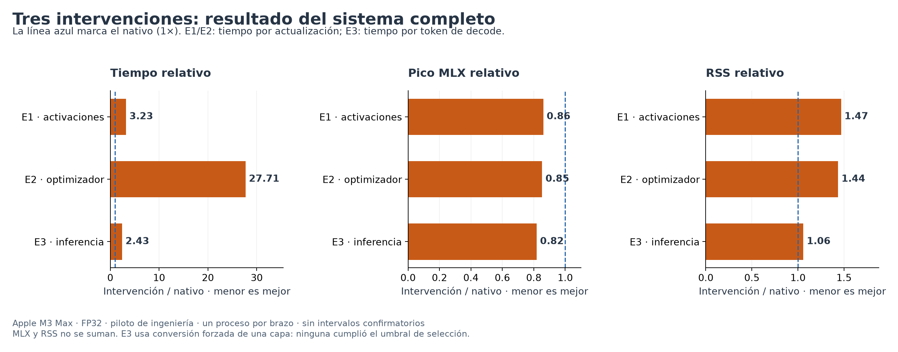
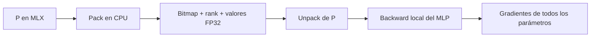
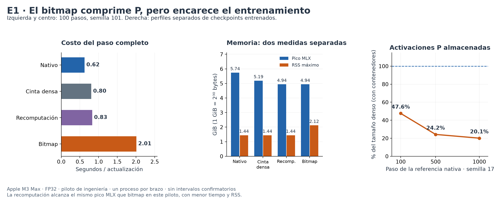
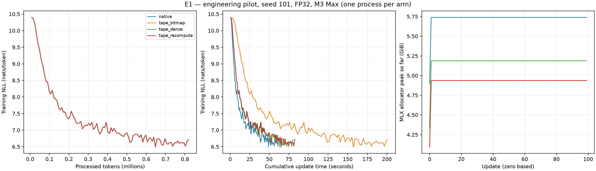
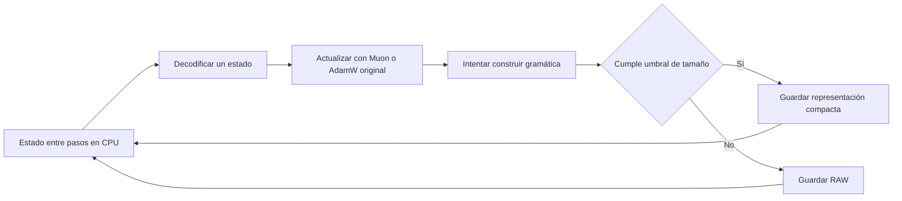
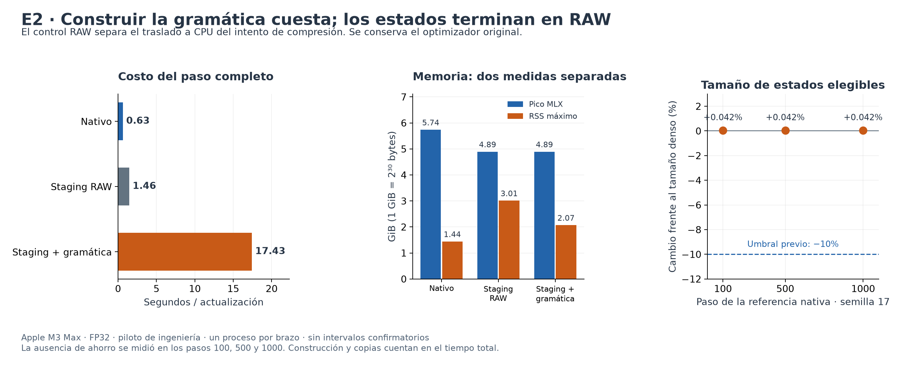
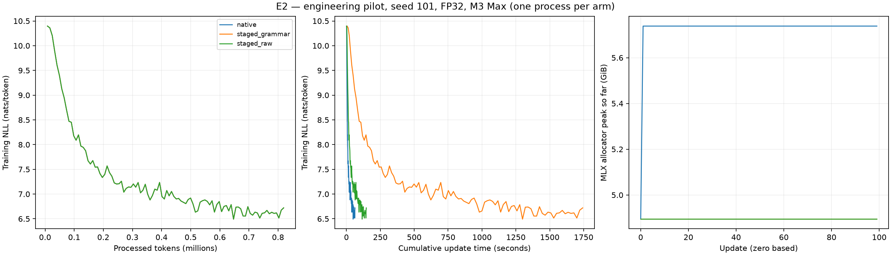
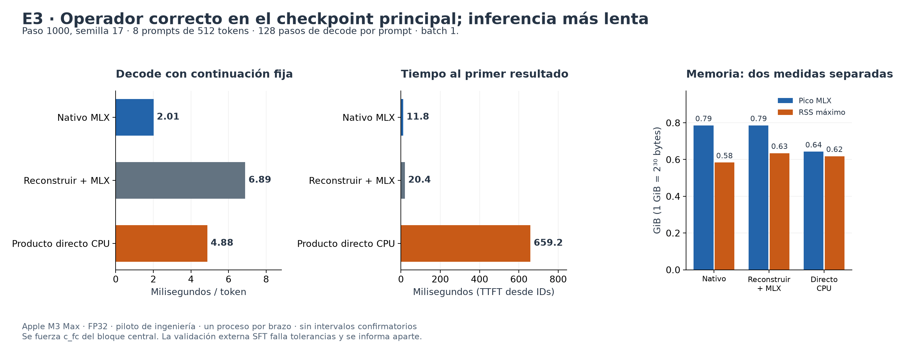

# nanochat-mlx

**Entrenamiento e inferencia de un modelo de lenguaje en Apple Silicon, con experimentos reproducibles de estructuras de datos compactas.**

Este proyecto parte del port a MLX de [nanochat, de Andrej Karpathy](https://github.com/karpathy/nanochat). Incluye descarga de datos, tokenización, preentrenamiento, ajuste supervisado y chat local. En este fork estudiamos si las técnicas de representación compacta pueden reducir el costo de entrenar y ejecutar ese modelo en un Mac.

La primera campaña implementó y midió tres adaptaciones de trabajos con Gonzalo Navarro como coautor. **Ninguna alcanzó una mejora global bajo los criterios del protocolo.** E1 logró comprimir activaciones y reducir el pico de memoria de MLX, pero aumentó el tiempo y el RSS. E2 y E3 no encontraron suficiente repetición en los tensores entrenados. Estos resultados delimitan lo que funciona en esta configuración y dejan una base medible para futuras investigaciones.

**Lectura rápida:** [resultados](#resultados) · [metodología](#metodologia) · [E1: activaciones](#e1) · [E2: optimizador](#e2) · [E3: inferencia](#e3) · [alcance y límites](#alcance) · [reproducción](#reproduccion) · [uso del chatbot](#uso)

<a id="resultados"></a>
## Resultados de la campaña

Mediciones del **14 de septiembre de 2026**, en **Apple M3 Max, 128 GiB de memoria unificada, MLX 0.32.2 y FP32**. El modelo principal tiene **125.829.648 parámetros**, 8 bloques y vocabulario de 32.768 tokens. La referencia matemática es el commit [`b54b9fc`](https://github.com/vtomasv/nanochat-mlx/tree/b54b9fc139f455a9a5e60dc9a688ca9dbdb22944).

| Experimento | Qué se cambia | Resultado observado frente a su nativo | Veredicto principal |
|---|---|---|---|
| **E1: activaciones compactas** | Cómo se conserva la activación positiva del MLP para calcular gradientes | Pico MLX **−13,95 %**; RSS **+46,81 %**; tiempo por paso **×3,23** | `NEGATIVE_SCREENING` |
| **E2: estados del optimizador** | Cómo se almacenan los estados entre actualizaciones | Sin ahorro de estado; pico MLX **−14,70 %**; RSS **+43,60 %**; tiempo por paso **×27,71** | `NEGATIVE_SCREENING` |
| **E3: producto sobre pesos comprimidos** | Cómo calcula una capa lineal durante inferencia | **0/16 matrices elegibles**; forzar una capa lleva el tiempo de decode a **×2,43** y aumenta el tamaño residente de pesos | `NEGATIVE_SCREENING_NO_COMPRESSIBILITY` |



*Cómo leer el gráfico:* cada barra se divide por el nativo de su propio experimento. Un valor menor que 1 es una reducción; mayor que 1 es un aumento. E1/E2 miden actualizaciones de entrenamiento y E3 mide tokens de decode: sus tiempos absolutos no son intercambiables. La conversión de E3 es forzada, porque la política de selección no aceptó ninguna capa.

**Verificación:** 97 tests aprobados y uno omitido por una dependencia opcional de conversión Hugging Face; ningún test Navarro omitido. Se verificaron los hashes de **51 registros de corridas y diagnósticos**. El checkpoint SFT externo presenta un fallo de tolerancia adicional, explicado en [E3](#e3-externo).

La evidencia está disponible en el [informe completo antes/después](experiments/navarro/results/informe_final.md), el [índice de corridas](experiments/navarro/results/report.md), el [JUnit](experiments/navarro/results/correctness-junit.xml) y la [auditoría](experiments/navarro/results/audit.json).

<a id="metodologia"></a>
## Cómo se llevó adelante el estudio

### La pregunta común

Una estructura compacta cambia la manera de **representar** información. Para ser útil en un modelo de lenguaje, el espacio que ahorra debe compensar el costo de construirla, consultarla y trasladarla entre CPU y GPU.

Probamos tres momentos distintos de la vida del modelo:


El diseño completo está en [ESPECIFICACIONES_NAVARRO_NANOCHAT_MLX.md](ESPECIFICACIONES_NAVARRO_NANOCHAT_MLX.md). Los umbrales de selección, tolerancias y controles se fijaron antes de la confirmación. Se mantuvieron arquitectura, parámetros aprendibles, corpus, tokenizer, precisión y ecuaciones originales de Muon y AdamW. No se introdujeron cuantización, poda ni cambios de rango. E1 y E2 se ensayaron por separado.

### Configuración y datos comunes

| Elemento | Configuración usada |
|---|---|
| Perfil principal | Depth 8; secuencia de 1024 tokens; ventanas `SSSL` |
| Modelo | 125.829.648 parámetros; vocabulario 32.768; FP32 |
| Batch | 4 secuencias por microbatch; 2 microbatches; 8192 tokens por actualización |
| Referencia nativa | Semilla 17; 1000 actualizaciones; 8.192.000 tokens procesados |
| Pilotos de entrenamiento | Semilla 101; 100 actualizaciones por brazo; 819.200 tokens por brazo |
| Validación | 128 secuencias: 32 de calibración y 96 reservadas para el informe |
| Perfiles entrenados | Checkpoints de referencia de los pasos 100, 500 y 1000 |
| Datos | Dos shards locales de 53.248 documentos cada uno; archivos y tokenizer fijados por hash |
| Límites | Memoria de trabajo MLX hasta 80 GiB; política de caché de 1 GiB |
| Entorno | macOS, Apple M3 Max, Python 3.12.11, MLX 0.32.2; dependencias en `uv.lock` |

La [referencia nativa completa](experiments/navarro/results/baseline/primary-native-reference-s17/report.md) terminó con **NLL 5,296038 nats/token** y **0,5991 s por actualización**. Esa NLL corresponde a 1000 pasos; las NLL de las tablas E1/E2 corresponden a pilotos de 100 pasos y se comparan entre sus propios controles.

### Secuencia experimental

1. **Fijar la referencia.** Se conservó una ejecución del CLI original y se contrastó con el ejecutor experimental. Los brazos de cada semilla cargaron los mismos bytes iniciales y usaron el mismo schedule de 1000 pasos, incluso al detener un piloto en el paso 100.
2. **Fijar los lotes.** El dataloader original produjo una cinta de entradas y targets exactos para 1100 actualizaciones. Esta modalidad, `replay`, permite comparar el cálculo sin mezclarlo con el costo de tokenización.
3. **Probar corrección.** Se verificaron reconstrucción bit a bit, operaciones locales, gradientes de cada parámetro, estados del optimizador, reanudación, logits y KV cache. Los tests de integración utilizaron MLX real.
4. **Ejecutar smoke y piloto.** Primero se usó el perfil pequeño. Después, cada brazo principal se ejecutó en un proceso nuevo. El calentamiento se descartó y se recargaron modelo, optimizador y RNG antes de medir.
5. **Medir el flujo original.** Cada variante de entrenamiento tuvo además 100 pasos con el dataloader original, etiquetados `pipeline`, incluyendo la preparación de lotes. Sus cifras se mantienen separadas de `replay`.
6. **Aplicar la puerta registrada.** Se examinó la compresión de estados realmente entrenados y el tiempo completo. Los pilotos negativos detuvieron la confirmación de mayor escala. E3 completó igualmente el ensayo obligatorio con una capa forzada y ocho prompts.

### Qué significan las medidas

- **NLL:** pérdida media por token; menor es mejor. Una diferencia pequeña en un piloto no establece por sí sola equivalencia de calidad.
- **Tiempo por paso:** actualización completa, con gradientes, actualización, transferencias y codec pertinentes. MLX es perezoso: se materializaron los resultados y se sincronizó el dispositivo antes de detener el reloj. La evaluación y el I/O de checkpoints se registran aparte.
- **Pico MLX:** máximo de memoria asignada por MLX durante la medición. **RSS:** memoria residente del proceso, con medición adicional del conjunto de procesos. Son medidas distintas: **no se suman** como si fueran memorias físicas independientes.
- **RAW:** almacenamiento denso sin compresión cuando la representación compacta no cumple el umbral. Diccionarios, índices, contenedores y copias también cuestan memoria.
- **TTFT:** tiempo desde IDs preparados hasta el primer resultado del modelo. **Decode:** cálculo incremental de los tokens posteriores con KV cache.

Los cocientes publicados son descriptivos de pilotos: **no tienen intervalos confirmatorios**. No se ejecutaron las tres trayectorias de semillas ni los cinco pares de procesos por ventana que corresponderían si las intervenciones hubieran superado la selección previa.

<a id="e1"></a>
## E1 — Guardar activaciones del MLP con bitmap y rank

### Idea: conservar los valores positivos y ubicar los ceros con bits

El MLP usa ReLU al cuadrado. Si `Z` es la salida de su primera proyección, calcula `P = max(Z, 0)` y después `P²`. El backward necesita información de esas activaciones; guardar todo `P` como una matriz densa también guarda sus ceros.

La adaptación conserva los valores positivos originales y un bitmap que marca dónde estaban:

| Representación | Ejemplo didáctico, sin contar cabeceras |
|---|---|
| Activación densa `P` | `[0, 2, 0, 3]` |
| Bitmap `B` | `[0, 1, 0, 1]` |
| Valores positivos | `[2, 3]` |
| Consulta de posición 3 | `B[3] = 1`; hay un bit encendido antes de ella; el valor es `valores[1] = 3` |

La operación **rank** cuenta bits encendidos antes de una posición. Se implementó con palabras de 32 bits y contadores muestreados cada 256 bits, siguiendo el compromiso entre índices y recorrido local de N1. El arreglo de valores tiene exactamente la capacidad necesaria para los positivos. Si el tamaño no compensa, se usa RAW.



La derivada de ReLU² se obtiene a partir de `2P`. No hace falta recuperar los valores negativos de `Z`. La representación es exacta en el dominio declarado de `P`; el cálculo de gradientes se comprueba con tolerancias porque su orden de operaciones puede cambiar.

### Implementación y controles

Se creó una cinta explícita de activaciones y backward por segmentos. Incluye atención, embeddings de valores, escalas residuales y el resto de parámetros aprendibles. La compresión y reconstrucción usan CPU/NumPy; los costos de movimiento hacia y desde MLX están incluidos.

| Brazo | Qué hace | Qué permite distinguir |
|---|---|---|
| `native` | Autodiff y entrenamiento originales en el ejecutor común | Costo actual del modelo |
| `tape_dense` | Cinta por segmentos, conservando `P` denso | Efecto de reorganizar el backward |
| `tape_recompute` | Misma cinta; recalcula `P` cuando hace falta | Efecto de intercambiar memoria por cómputo |
| `tape_bitmap` | Misma cinta; guarda y reconstruye `P` compacto | Beneficio y costo atribuibles al bitmap |

### Resultados medidos

**Replay · 100 pasos por brazo · semilla 101 · mismo modelo y validación.** GiB usa unidades de 2³⁰ bytes.

| Brazo | s/paso ↓ | Tokens/s ↑ | Pico MLX (GiB) ↓ | RSS (GiB) ↓ | NLL final ↓ |
|---|---:|---:|---:|---:|---:|
| Nativo | 0,6228 | 13.153 | 5,738 | 1,444 | 6,6302656 |
| Cinta densa | 0,8039 | 10.190 | 5,188 | 1,443 | 6,6302693 |
| Recomputación | 0,8287 | 9885 | 4,938 | 1,443 | 6,6302703 |
| Bitmap | 2,0098 | 4076 | 4,938 | 2,119 | 6,6302928 |



Durante los pasos 50–99 del piloto, `P` compacto ocupó **49,39 %** de su tamaño denso, incluidos contenedores CPU. En perfiles separados de la referencia entrenada, ocupó aproximadamente **47,56 %, 24,22 % y 20,07 %** en los pasos 100, 500 y 1000. Los gradientes de todos los parámetros pasaron las tolerancias en esos perfiles.



*Lectura de las curvas:* las pérdidas casi se superponen al comparar la misma cantidad de tokens. Al compararlas contra tiempo, el bitmap tarda más en recorrer la trayectoria. El tercer panel muestra que la recomputación ya alcanza el mismo pico MLX del bitmap. El eje temporal suma actualizaciones; no incluye evaluación ni escritura de checkpoints.

### Impacto y veredicto

**La estructura comprime activaciones, pero no mejora globalmente este entrenamiento.** El pico MLX baja 13,95 %, mientras que el RSS sube 46,81 % y el paso tarda 3,23 veces lo del nativo. La diferencia final de NLL es +0,0000272 nats/token, descriptiva de una sola semilla.

La regla previa cerraba el experimento si el paso costaba más de 2× el nativo o si el ahorro de `P` era insuficiente. Se incumplió el límite temporal: **`NEGATIVE_SCREENING`**. La recomputación demuestra por qué no puede atribuirse toda la reducción del pico MLX al bitmap. El resultado identifica una representación útil para almacenar `P`, pero su integración CPU/MLX medida no justifica adoptarla como mejora del entrenamiento.

**Evidencia:** [decisión y controles](experiments/navarro/results/E1/primary-pilot-decision-s101-20260914T155331700057Z/report.md) · [mediciones bitmap](experiments/navarro/results/E1/primary-pilot-tape_bitmap-s101/steps.csv) · [tamaño de tensores](experiments/navarro/results/E1/primary-pilot-tape_bitmap-s101/tensors.csv) · [implementación](nanochat_mlx/experiments/activation_tape.py).

<a id="e2"></a>
## E2 — Comprimir estados de Muon y AdamW entre pasos

### Idea: aprovechar repetición exacta en el estado persistente

El optimizador conserva información de actualizaciones anteriores: un buffer para Muon y momentos para AdamW. Esa información ocupa memoria incluso entre pasos. E2 pregunta si una gramática puede representarla sin pérdida y compensar su reconstrucción y recompresión en cada actualización.

El codec usa la representación **CSRV** de N3. Un símbolo identifica un **valor FP32 exacto y su columna**. RePair sustituye pares de símbolos repetidos por reglas compartidas. Se procesan bloques de 128 filas; las reglas no cruzan límites de fila. Se comparan `re_32` —enteros de 32 bits— y `re_iv` —enteros físicamente empaquetados— y se elige RAW cuando el bloque no alcanza el umbral del 95 % del denso.

No basta con que dos valores sean parecidos: tienen que repetirse los patrones exactos que la representación puede reutilizar. Se conservan los bits de los valores; los patrones IEEE especiales tienen fallback RAW.



### Implementación y controles

Los gradientes se materializan antes de actualizar los pesos. Se reconstruye cada estado cuando hace falta y se libera su representación temporal tras usarlo. Los estados persistentes se mantienen en CPU; no se conserva una copia densa permanente oculta en MLX. Las ecuaciones y grupos del optimizador se heredan de la implementación original.

| Brazo | Estado entre actualizaciones | Qué separa |
|---|---|---|
| `native` | Estado nativo de MLX | Referencia |
| `staged_raw` | Estado en CPU, sin compresión | Costo y memoria del traslado a CPU (*staging*) |
| `staged_grammar` | Estado en CPU; intento de gramática y fallback RAW | Efecto adicional del codec |

La corrección incluyó **20 actualizaciones con gradientes predeterminados idénticos**, comparación de estados y parámetros, matrices altas y anchas, contadores AdamW y restauración de checkpoints. También se probaron estados sintéticos que sí se comprimen; eso valida el mecanismo, sin convertirlos en evidencia de ahorro sobre estados aprendidos.

### Resultados medidos

**Replay · 100 pasos por brazo · semilla 101.**

| Brazo | s/paso ↓ | Tokens/s ↑ | Pico MLX (GiB) ↓ | RSS (GiB) ↓ | NLL final ↓ |
|---|---:|---:|---:|---:|---:|
| Nativo | 0,6290 | 13.025 | 5,738 | 1,443 | 6,6302537 |
| Staging RAW | 1,4644 | 5594 | 4,894 | 3,014 | 6,6302632 |
| Staging + gramática | 17,4278 | 470 | 4,894 | 2,072 | 6,6302538 |



| Checkpoint de referencia | Bytes residentes elegibles / bytes densos | Selección |
|---|---:|---|
| Paso 100 | 1,000419 | Todo RAW |
| Paso 500 | 1,000419 | Todo RAW |
| Paso 1000 | 1,000419 | Todo RAW |

En la última actualización del piloto, los **68 tensores registrados quedaron en RAW** y el estado residente total ocupó **100,0418 %** del payload denso. El pequeño exceso proviene de la representación y sus contenedores. El costo de intentar construir la gramática se paga aunque al final se descarte y se guarde RAW.



*Lectura de las curvas:* los brazos siguen pérdidas muy próximas por tokens procesados. La gran separación del panel temporal muestra el costo del codec; no una mejora en aprendizaje. Staging RAW y staging con gramática tienen prácticamente el mismo pico MLX.

### Impacto y veredicto

**El traslado de estado a CPU reduce asignaciones de MLX; la gramática no consigue comprimir los estados entrenados.** Frente al nativo, el brazo con gramática cuesta 27,71× por paso y aumenta el RSS 43,60 %. El RSS menor que el de `staged_raw` no demuestra compresión: los bytes persistentes y el fallback muestran que los estados siguen siendo RAW.

La puerta exigía al menos 10 % de ahorro en dos de los tres checkpoints y un costo por paso no superior a 2×. Ambas condiciones fallaron: **`NEGATIVE_SCREENING`**.

El constructor es una **implementación propia compilada en C++ con recuentos repetidos de frecuencias**. Su tiempo no evalúa la implementación lineal de los autores. El resultado permite descartar esta combinación de representación e integración en la muestra medida; no demuestra que todo constructor RePair tendría el mismo costo.

**Evidencia:** [decisión](experiments/navarro/results/E2/primary-pilot-decision-s101-20260914T155331854039Z/report.md) · [pasos crudos](experiments/navarro/results/E2/primary-pilot-staged_grammar-s101/steps.csv) · [perfil del paso 1000](experiments/navarro/results/E2/primary-E2-screen-1000/events.jsonl) · [codec C++](nanochat_mlx/experiments/native.cpp) · [state store](nanochat_mlx/experiments/staged_optimizer.py).

<a id="e3"></a>
## E3 — Multiplicar directamente sobre pesos representados por gramáticas

### Idea: reutilizar cálculos de patrones compartidos

E3 reutiliza el codec de E2, ahora para pesos entrenados del MLP. La diferencia central es que el producto directo **no reconstruye toda la matriz en cada token**: evalúa las reglas de la gramática y suma sus contribuciones a cada fila.

Por ejemplo, para una matriz didáctica:

```text
W = [[2, 3, 0],       q = 2·x₀ + 3·x₁
     [2, 3, 5]]      W·x = [q, q + 5·x₂]
```

La primera parte de ambas filas se puede compartir. Una fila `[3, 2, 0]` no reutiliza ese mismo patrón: **la columna forma parte del símbolo**. Este ejemplo explica el mecanismo; no predice repetición en pesos de una red entrenada.

Se implementaron el producto derecho y el transpuesto, con evaluación del grafo de reglas en orden de dependencias. `re_iv` se consulta empaquetado. El prefill procesa microbloques de 16 vectores para limitar temporales. La capa reemplazada queda congelada y no mantiene una copia densa permanente. No se implementó un kernel directo Metal: el brazo directo es **CPU compilada con transferencias MLX↔CPU incluidas**.

### Selección del modelo y carga de trabajo

1. Se eligió de antemano el checkpoint nativo **paso 1000, semilla 17, depth 8**.
2. Se examinaron las **16 matrices MLP**: `c_fc` y `c_proj` de los ocho bloques, con el mismo umbral de tamaño ≤95 % de RAW.
3. **Ninguna fue elegible.** La política adaptativa es `NO_ELIGIBLE_LAYERS`: conservaría el cálculo nativo.
4. Como exige la puerta negativa, se forzó `blocks.4.mlp.c_fc.weight`, la primera proyección del bloque central, para medir el costo real de la propuesta.
5. Cada brazo procesó **8 prompts reservados de 512 tokens**, batch 1 y **128 pasos de decode por prompt**. La continuación de tokens fue fija e idéntica entre brazos (*teacher-forced decode*).

La continuación fija evita comparar contextos que ya divergieron durante generación. La generación greedy se ejecutó aparte, con EOS natural y máximo de 128 tokens. En estos ocho prompts, ambos brazos experimentales coincidieron con el nativo en sus secuencias de 128 tokens: [concordancia registrada](experiments/navarro/results/E3/greedy-comparison.json).

| Brazo | Cómo calcula la capa forzada |
|---|---|
| `dense_native` | Matriz densa original, cálculo MLX |
| `compressed_decode_dense` | Almacena la representación gramatical y reconstruye la matriz para calcular en MLX |
| `grammar_direct_cpu` | Calcula directamente sobre los símbolos y reglas, con CPU compilada |

### Resultados medidos

**Checkpoint paso 1000 · ocho prompts · un proceso por brazo.** Las latencias incluyen el modelo completo, no solo la capa reemplazada. El tiempo de solicitud es prefill + 128 pasos de decode, sin carga ni conversión inicial.

| Brazo | Decode medio (ms/token) ↓ | p95 decode (ms/token) ↓ | TTFT (ms) ↓ | Solicitud (s) ↓ | Conversión inicial (ms) |
|---|---:|---:|---:|---:|---:|
| Nativo MLX | 2,011 | 3,061 | 11,80 | 0,2693 | 0 |
| Reconstruir + MLX | 6,891 | 8,609 | 20,38 | 0,9025 | 86,35 |
| Producto directo CPU | 4,879 | 6,834 | 659,19 | 1,2837 | 84,93 |



| Brazo | Pesos y estructuras residentes (MiB) ↓ | Pico MLX (GiB) ↓ | RSS (GiB) ↓ |
|---|---:|---:|---:|
| Nativo MLX | 480,002 | 0,785 | 0,584 |
| Reconstruir + MLX | 483,134 | 0,786 | 0,635 |
| Producto directo CPU | 483,134 | 0,643 | 0,618 |

El producto directo pasó la corrección local y del modelo principal. En los ocho prefijos comprobados, el error máximo de logits fue aproximadamente **1,05×10⁻⁵** y la máxima diferencia absoluta de NLL fue **4,77×10⁻⁷ nats/token**, dentro de las tolerancias fijadas. Véanse los [errores por prompt y vector](experiments/navarro/results/E3/primary-E3-correctness/correctness.json).

### Impacto y veredicto principal

**No hay compresibilidad suficiente en las matrices entrenadas examinadas.** Forzar una capa aumenta los bytes residentes totales de pesos en 0,65 %, el RSS en 5,93 % y el tiempo de decode en 2,43×. El TTFT pasa de 11,80 a 659,19 ms y la solicitud completa tarda 4,77×. El pico MLX menor no compensa esos costos.

El punto de amortización de la conversión es **`never`** en el régimen de decode medido: el tiempo por token directo es mayor que el nativo, por lo que no recupera el costo inicial mediante ahorro posterior.

El veredicto es **`NEGATIVE_SCREENING_NO_COMPRESSIBILITY`**. Se completó el ensayo forzado que exige el protocolo, pero no se inició confirmación de una política que no seleccionó ninguna capa.

El [control del paso cero](experiments/navarro/results/E3/primary-E3-step0-diagnostic/tensors.csv) sí encontró **8/16 matrices elegibles**: las proyecciones `c_proj` inicialmente nulas. Después de entrenar, el resultado fue **0/16**. Esto muestra por qué medir solamente la inicialización habría dado una impresión equivocada del potencial de compresión.

<a id="e3-externo"></a>
### Validación externa: una limitación numérica adicional

También se examinó el checkpoint SFT local **depth 4, paso 257033, 36.700.296 parámetros**. Su procedencia de entrenamiento y hash de tokenizer no están completamente registrados; se conserva como evidencia complementaria, sin sustituir el checkpoint principal.

- **0/8 matrices MLP elegibles** por tamaño.
- La NLL pasó la tolerancia, pero los logits del producto directo no: error máximo absoluto **0,000329**.
- La reconstrucción seguida del cálculo denso MLX produjo logits exactamente iguales a los nativos.
- En el diagnóstico local, **uno de ocho vectores** incumplió la tolerancia frente al oráculo FP64.

Se registró **`FAILURE_CORRECTNESS`** para esta validación externa. La discrepancia aparece en el producto CPU, no en la reconstrucción de los pesos. No se ampliaron tolerancias ni se cambió el operador después de medir. Que una implementación pase en el checkpoint principal no garantiza que satisfaga las mismas tolerancias en otro modelo.

**Evidencia:** [todas las matrices principales](experiments/navarro/results/E3/primary-E3-screen/tensors.csv) · [decisión principal](experiments/navarro/results/E3/primary-pilot-decision-s101-20260914T155332003003Z/report.md) · [diagnóstico externo](experiments/navarro/results/E3/external-E3-sft-d4-reduction-diagnostic/correctness.json) · [operador](nanochat_mlx/experiments/grammar_linear.py).

<a id="alcance"></a>
## Qué enseñan los controles y hasta dónde llegan las conclusiones

### El flujo con dataloader original confirma el costo observado

Estas cifras son una medición adicional `pipeline`, con 100 pasos y preparación de lotes incluida. No se combinaron con replay para producir intervalos o nuevas réplicas.

| Experimento | Brazo | Replay (s/paso) | Pipeline (s/paso) |
|---|---|---:|---:|
| E1 | Nativo | 0,6228 | 0,6326 |
| E1 | Cinta densa | 0,8039 | 0,8038 |
| E1 | Recomputación | 0,8287 | 0,8288 |
| E1 | Bitmap | 2,0098 | 2,0089 |
| E2 | Nativo | 0,6290 | 0,6112 |
| E2 | Staging RAW | 1,4644 | 1,4739 |
| E2 | Staging + gramática | 17,4278 | 18,2215 |

La conclusión práctica se mantiene en ambos modos: el bitmap y el intento de gramática aumentan el tiempo completo. Los [perfiles separados de fases](experiments/navarro/results/informe_final.md) añaden barreras explícitas para estudiar forward, backward, pack/unpack y actualización; sus tiempos anidados no se suman de nuevo al timing principal.

### Tres niveles de resultado

| Nivel | E1 | E2 | E3 principal |
|---|---|---|---|
| **Representación** | Compacta y exacta para las activaciones positivas | Codec exacto; estados entrenados quedan RAW | Codec exacto; ninguna matriz entrenada elegible |
| **Operador / integración** | Gradientes dentro de tolerancia | Actualización y estados validados | Producto y logits dentro de tolerancia |
| **Modelo completo** | Ahorro MLX con mayor RSS y tiempo | Mayor tiempo sin ahorro de estado | Mayor latencia y pesos residentes al forzar una capa |

La compresión útil de un objeto es un resultado parcial. Para demostrar una mejora del entrenamiento o la inferencia bajo este protocolo deben cumplirse conjuntamente corrección, calidad y límites prácticos de memoria y tiempo.

### Límites de la evidencia

- **Aprendizaje temprano:** 1000 pasos de referencia no demuestran convergencia ni calidad competitiva. Las conclusiones principales corresponden a esta familia de checkpoints y al M3 Max medido.
- **Sin confirmación estadística:** los pilotos activaron las puertas negativas; los intervalos y la no inferioridad confirmatoria permanecen `null`. No se trata cada token correlacionado como un experimento independiente.
- **Datos:** se encontraron 43 documentos idénticos entre los dos shards. El packing no conserva su procedencia por documento, por lo que no se reporta bootstrap agrupado por documento. Tokens procesados no significa tokens únicos.
- **Variación nativa:** el propio CLI mostró pequeñas diferencias numéricas entre repeticiones. El [diagnóstico nativo/nativo y nativo/harness](experiments/navarro/results/native-variability.json) pasó las tolerancias de logits y NLL; no se afirma identidad bit a bit de trayectorias largas.
- **Implementación concreta:** RePair usa un constructor propio de recuentos repetidos; E1 y el producto directo E3 tienen componentes CPU. No se midió un operador directo Metal ni se reprodujeron los benchmarks de los autores.
- **Trazabilidad histórica:** cuatro índices smoke de E1 se reconciliaron porque aún describían el marcador inicial de corrección. Se preservaron los índices previos y los CSV; el XML de aquella puerta temprana no se conservó. La [reconciliación](experiments/navarro/results/audit-metadata-reconciliation.json) y la suite final son evidencias diferenciadas. La primera referencia tiene lecturas de swap antes/después, no el muestreo continuo incorporado después.

**El objetivo de investigación sigue abierto.** Un siguiente estudio podría evaluar una integración bitmap en GPU o un constructor gramatical más eficiente, con su propio protocolo y controles. Son hipótesis futuras: esta campaña no las implementó ni demostró su beneficio. También habría que volver a comprobar tamaño, RSS, tiempo completo y tolerancias, incluido el fallo externo observado.

<a id="reproduccion"></a>
## Reproducir, inspeccionar y extender los experimentos

### Leer los resultados sin volver a entrenar

El repositorio contiene CSV, JSON, logs, gráficos, manifiestos y hashes. Los corpus, PDFs descargados, bibliotecas compiladas y checkpoints grandes quedan fuera de Git. Las rutas absolutas de los manifiestos describen la máquina de la campaña; deben adaptarse al reproducir en otra instalación.

| Recurso | Contenido |
|---|---|
| [Especificación v1.0](ESPECIFICACIONES_NAVARRO_NANOCHAT_MLX.md) | Hipótesis, perfiles, tolerancias, controles y criterios |
| [Informe completo](experiments/navarro/results/informe_final.md) | Tablas, decisiones y enlaces a todas las corridas |
| [Mapa de fuentes](docs/navarro/source_map.md) | PDF/versiones/hashes, secciones aplicadas y diferencias propias |
| [Notas de implementación](docs/navarro/implementation.md) | Cinta, codec, estados, memoria e incidencias |
| [Runbook](docs/navarro/runbook.md) | Comandos y condiciones de ejecución |
| [Generador de imágenes](docs/navarro/generate_readme_figures.py) | Nuevas figuras del README a partir de mediciones guardadas |
| [Procedencia de imágenes](docs/navarro/images/provenance.json) | Archivos fuente y sus SHA-256 |

Para regenerar las imágenes, sin ejecutar MLX ni entrenamiento:

```bash
uv run --frozen --with matplotlib python docs/navarro/generate_readme_figures.py
```

Los gráficos nuevos se guardan en PNG y SVG. Las dos figuras de curvas de aprendizaje provienen de los CSV y del [generador de curvas de la campaña](nanochat_mlx/experiments/plots.py). Ninguna imagen contiene resultados sintéticos presentados como mediciones.

### Ejecutar una nueva campaña

Se requiere un Mac Apple Silicon con Metal disponible, `uv`, compilador C++ y los datos/tokenizer especificados. Usar [configuración principal](configs/navarro/primary.json), [smoke](configs/navarro/smoke.json) y [runbook](docs/navarro/runbook.md) como punto de partida. Las corridas nuevas deben tener directorios propios; los IDs guardados son exclusivos y los manifiestos no se sobrescriben.

```bash
# Entorno, datos de replay y comprobación de corrección
uv sync --frozen
uv run --frozen python -m scripts.navarro_experiments preflight --config configs/navarro/primary.json
uv run --frozen python -m scripts.navarro_experiments prepare --config configs/navarro/primary.json
uv run --frozen python -m pytest tests/ -v

# Inspeccionar el presupuesto antes de confirmar: no ejecuta entrenamiento
uv run --frozen python -m scripts.navarro_experiments run \
  --experiment E1 --stage confirm --config configs/navarro/primary.json --dry-run
```

La secuencia completa —smoke, referencia, pilotos y diagnósticos— está en el runbook. `confirm` consulta la evidencia: con los veredictos actuales devuelve `not_applicable`. Para estudiar una nueva intervención hace falta una nueva campaña identificable, conservando los resultados anteriores.

<a id="uso"></a>
## Usar nanochat-mlx como chatbot local

Los experimentos viven en módulos aislados y no sustituyen los entrypoints ordinarios del modelo.

### Inicio rápido

```bash
git clone https://github.com/vtomasv/nanochat-mlx.git
cd nanochat-mlx
uv sync
uv run python -m scripts.quickstart
```

Abrir [http://127.0.0.1:8000](http://127.0.0.1:8000). El asistente web guía la descarga de datos, entrenamiento del tokenizer, entrenamiento del modelo y chat. También se puede activar `.venv` y omitir `uv run` en los comandos posteriores.

### Pipeline por CLI

```bash
uv run python -m nanochat_mlx.dataset -n 2
uv run python -m scripts.tok_train
uv run python -m scripts.train --depth=4
uv run python -m scripts.sft --depth=4
uv run python -m scripts.chat --depth=4 --source=sft --interactive
uv run python -m scripts.chat_eval --depth=4
```

`--depth` controla la profundidad y los escalados del modelo. El tamaño depende también del vocabulario: los conteos observados aquí son **36,7 M para depth 4** y **125,8 M para depth 8** con vocabulario 32.768. Los tiempos de esta campaña corresponden al perfil medido en M3 Max; no son una estimación de entrenamiento completo para otros Mac o profundidades.

Se necesita Apple Silicon y memoria suficiente para el perfil elegido. Conviene comenzar por el perfil smoke y medir el pico real antes de escalar. No se extrapola una recomendación de RAM únicamente a partir del tamaño del archivo de pesos.

### Importar un checkpoint de Hugging Face

```bash
uv sync --extra convert
uv run python -m scripts.convert_from_hf --repo nanochat-students/base-d20
```

La conversión puede requerir PyTorch como dependencia opcional; el pipeline MLX ordinario funciona sin él.

### Organización y pruebas

```text
nanochat_mlx/                 Modelo, entrenamiento, optimizador, KV cache y datos
nanochat_mlx/experiments/     Implementaciones aisladas E1/E2/E3 y medición
scripts/                     Entrypoints ordinarios y navarro_experiments.py
configs/navarro/             Perfiles cerrados smoke, primary y confirm
tests/test_navarro_*.py       Codec, gradientes, optimizador, replay e inferencia
experiments/navarro/results/ Evidencia versionada de la campaña
docs/navarro/                Fuentes, implementación, reproducción e imágenes
```

```bash
uv run python -m pytest tests/ -v
```

La suite combina tests ligeros con pruebas de integración que requieren MLX real. Una omisión por falta de Metal no cuenta como validación del experimento.

### Proyectos relacionados del port original

- [gemma4-m4-pro](https://github.com/scasella/gemma4-m4-pro)
- [train-gemma4-sudoku-on-your-macbook](https://github.com/scasella/train-gemma4-sudoku-on-your-macbook)
- [ttt-discover-autoresearch-mlx](https://github.com/scasella/ttt-discover-autoresearch-mlx)
- [autoresearch-evo](https://github.com/scasella/autoresearch-evo)

## Fundamento y atribución

Las estructuras se basan en trabajos con Gonzalo Navarro como autor. **Las aplicaciones al entrenamiento, la selección de capas, los umbrales y los resultados de este README son adaptaciones de este proyecto.**

| Fuente | Qué se tomó para el estudio |
|---|---|
| N1 — González, Grabowski, Mäkinen y Navarro. *Practical Implementation of Rank and Select Queries* (2005), §1.3 | Bitmap, contadores muestreados y recorrido local para rank en E1 |
| N2 — Navarro y Providel. *Fast, Small, Simple Rank/Select on Bitmaps* (2012) | Selección de operaciones necesarias; E1 necesita acceso/rank, no select |
| N3 — Ferragina et al. *Improving Matrix-vector Multiplication via Lossless Grammar-Compressed Matrices* (2022), §§2–4 | CSRV, RePair, `re_32`/`re_iv` y productos derecho/transpuesto para E2/E3 |
| N4 — Navarro. *Practical Adaptive Dynamic Bitvectors* (2025) | Contraste que motivó excluir un árbol dinámico para activaciones inmutables de vida corta |

Las referencias completas, enlaces, versiones y hashes están en el [mapa de fuentes](docs/navarro/source_map.md). El código de gramáticas fue escrito a partir de la publicación; no se copió el código de los autores ni se validó contra su binario.

La arquitectura y el pipeline original proceden de [nanochat](https://github.com/karpathy/nanochat). El punto de partida de MLX es el [port de scasella](https://github.com/scasella/nanochat-mlx), cuyo autor presenta otros proyectos en [casella.dev](https://casella.dev). Este fork añade la campaña experimental y su evidencia.
