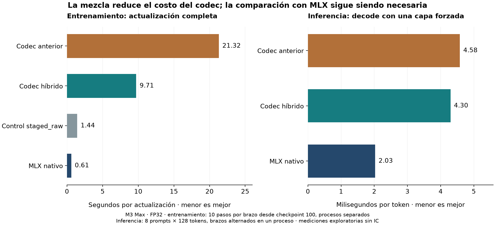

# Mezcla de métodos: codec RePair híbrido

Seguimiento de ingeniería de la campaña Navarro, 14 de septiembre de 2026. La combinación conserva el formato compacto propio y adopta, con código independiente, el mantenimiento incremental de pares estudiado en [MM RePair](https://gitlab.com/manzai/mm-repair). Añade un descarte matemático de bloques que no pueden comprimir. Los resultados originales de E1, E2 y E3 permanecen como evidencia histórica de sus implementaciones.

## Qué se combinó y por qué

1. **Formato propio `re_iv` y fallback RAW.** Se conservan los enteros empaquetados, diccionarios de valores FP32 exactos, bloques de 128 filas, delimitadores, umbral del 95 % y archivos de checkpoints. No hay cuantización ni pérdida de información.
2. **Actualización incremental de pares.** La versión anterior recorría toda la secuencia después de cada sustitución. La nueva conserva posiciones enlazadas, listas de ocurrencias y una cola de frecuencias: solo actualiza las vecindades afectadas. Mantiene el desempate por par y el orden de sustitución de izquierda a derecha. Una primera pasada de frecuencias conserva la ruta sencilla cuando no hay pares repetidos, evitando entonces las estructuras incrementales. Es una implementación propia; no se afirma que tenga la complejidad lineal de los autores.
3. **Descarte temprano exacto.** Construir una gramática para terminar guardando RAW puede consumir casi todo el beneficio. La nueva variante detecta casos imposibles durante la construcción del diccionario y devuelve los bytes RAW originales.

La aritmética del producto y del entrenamiento continúa en FP32, con contracción FMA desactivada en el C++. No se incorporan los componentes externos con avisos GPL, la acumulación intermedia `double`, el paralelismo pthread ni nuevos formatos. La [revisión previa](mm-repair-assessment.md) explica esas diferencias. E1 no requiere cambios para esta combinación.

## Por qué el descarte es seguro

Sea `N` el número de celdas de un bloque y `d` la cantidad de valores no nulos distintos encontrados. Como cada valor repetido necesita al menos dos apariciones, **al menos `max(0, 2d − N)` valores aparecen una sola vez**. Usar todas las celdas como límite sigue siendo conservador aunque existan ceros.

Un terminal que aparece una sola vez no puede formar parte de una regla repetida. Por tanto, deben almacenarse al menos:

```text
64 bytes de cabecera
+ 4 × d bytes de diccionario
+ los terminales únicos inevitables, al ancho mínimo del formato
```

El cálculo omite reglas, otros terminales y delimitadores: es una cota inferior. Si aun así supera el 95 % del tamaño denso, ninguna gramática de este formato podrá ser aceptada. Una búsqueda binaria calcula una sola vez por bloque cuántos valores distintos bastan para demostrarlo; después solo se compara un contador. No se usa una muestra probabilística ni una estimación de entropía.

Los tests contrastan el resultado adaptativo con construir realmente ambos formatos forzados y aplicar la política original. Incluyen matrices repetitivas, vacías, dispersas, bloques parciales y distintas proporciones de valores únicos cerca del corte.

## Comparación del codec con datos entrenados

La referencia es **nuestro codec del commit `7787ae2`**, compilado con las mismas opciones que el híbrido. Ambas rutas se llaman en memoria, sin procesos ni archivos intermedios dentro del cronómetro. Cada caso descarta un calentamiento y mide cinco repeticiones alternando el orden de ejecución.

Se utilizan los mismos 14 bloques de 128 filas de la revisión previa: seis estados Muon de los checkpoints 100/500/1000, seis segmentos AdamW del checkpoint 1000 y dos matrices de pesos. Se agregan una matriz aleatoria y otra repetitiva. Cada matriz se ensaya en modo adaptativo y `re_iv` forzado: **32 comparaciones**.

- Los 32 formatos resultantes son idénticos, byte por byte, a los de la implementación anterior.
- La reconstrucción es exacta y los productos derecho y transpuesto comparados son idénticos.
- El modo adaptativo acelera los 14 bloques entrenados entre **1,71× y 2,82×**. Todos siguen eligiendo RAW: se ahorra trabajo de construcción, no espacio adicional.
- El fixture repetitivo acelera aproximadamente **1,61×** en adaptativo y **1,60×** en `re_iv`, conservando su compresión.
- En `re_iv` forzado sobre los bloques reales, los cocientes quedan aproximadamente entre **1,00× y 1,07×**. No se atribuye una aceleración de inferencia a estas pequeñas diferencias de construcción.

Son medianas de un diagnóstico CPU, sin intervalos confirmatorios. La muestra no representa todos los tensores posibles. [Datos finales por bloque y repetición](../../experiments/navarro/verification/hybrid-repair-v2/codec.json).

## Validación completa y mediciones

La suite completa de la versión final registra **118 pruebas aprobadas y una omitida** por la dependencia opcional de conversión Hugging Face. Incluye reconstrucción, serialización, gramáticas corruptas, reglas frente a un oráculo independiente, productos, gradientes, 20 actualizaciones de optimizador con estados comprimidos, reanudación de checkpoints e inferencia con caché KV. Los tests Navarro de integración utilizan Metal real.

La ventana adicional de entrenamiento parte del checkpoint nativo 100, semilla 17, y ejecuta diez actualizaciones hasta el checkpoint 110. Cada brazo corre en un proceso nuevo, verifica la cinta de lotes, descarta calentamiento, recarga pesos/optimizador/RNG y conserva el schedule de 1000 pasos. Cada actualización procesa 8192 tokens. El cronómetro incluye forward, backward, transferencias, actualización y codec; la evaluación de 96 secuencias y la escritura de checkpoints quedan fuera.

La comprobación principal de inferencia carga el checkpoint 1000, semilla 17. Compara MLX nativo, codec anterior e híbrido, forzando la misma capa central `blocks.4.mlp.c_fc`. Utiliza ocho prompts de 512 tokens y 128 tokens posteriores por prompt, con una caché KV nueva para cada ejecución. Los brazos alternan orden en un proceso; se contrastan los logits del último token de prefill y de cada paso de decode. Este seguimiento no vuelve a evaluar el checkpoint SFT externo que falló en v1.

## Resultados de entrenamiento e inferencia



### Entrenamiento: diez actualizaciones reales

| Brazo | s/actualización | NLL final | Pico MLX (MiB) | RSS máximo (MiB) |
|---|---:|---:|---:|---:|
| Codec anterior (`7787ae2`) | 21.3169 | 6.563254391 | 5011.96 | 2328.22 |
| Codec híbrido final | 9.7114 | 6.563254396 | 5011.96 | 2527.14 |
| Control `staged_raw` | 1.4376 | 6.563254396 | 5011.96 | 3176.59 |
| MLX nativo | 0.6132 | 6.563254376 | 5875.96 | 1469.72 |

El híbrido es **2.20× más rápido que el codec anterior**, una reducción del **54.44 %** del tiempo por actualización. Sin embargo, sigue siendo **15.84× más lento que MLX nativo**, y también más lento que el control RAW. Los 68 estados registrados permanecen sin compresión. El pico MLX no cambia frente al codec anterior y el RSS observado aumenta: esta medición demuestra una mejora de tiempo de la implementación, no un ahorro adicional de memoria. MLX y RSS se informan por separado y no se suman.

### Corrección de la trayectoria y variación entre procesos

Los 76 tensores/counters del optimizador cumplen la comparación elemento a elemento (`atol=1e-5`, `rtol=1e-3`) entre híbrido y cada control. **Los pesos finales no son todos idénticos ni todos cumplen esa tolerancia estricta**: hay excepciones en embeddings. Frente al codec anterior, el máximo absoluto es 0,00177005; el máximo error L2 relativo por tensor es 2,66e-6. La diferencia de NLL es 4,97e-9.

Se ejecutó por ello un segundo proceso nativo, con el mismo checkpoint y diez lotes. También presenta excepciones en embeddings: máximo absoluto 0,00051443, máximo L2 relativo 2,67e-6 y diferencia de NLL de 3,97e-8. Esto demuestra variación entre procesos incluso sin codec; no identifica la causa ni prueba que explique toda diferencia del híbrido. No se ampliaron tolerancias, no se ocultaron los fallos por tensor y no se declara determinismo de la trayectoria ni no inferioridad confirmatoria. Las actualizaciones con gradientes idénticos sí pasan las pruebas bit a bit del optimizador.

[Comparación de los checkpoints finales](../../experiments/navarro/verification/hybrid-repair-v2/comparison.json) · [Repetición nativa y errores por tensor](../../experiments/navarro/verification/hybrid-repair-v2/training-reproducibility.json).

### Inferencia: mismo resultado, sin nueva ventaja demostrada

En los ocho prompts, los logits del codec anterior y del híbrido son **idénticos bit a bit**. Los logits del híbrido cumplen `atol=1e-4`, `rtol=1e-3` frente al nativo. La caché alcanza correctamente 640 tokens.

| Brazo | Prefill medio (ms) | Decode medio (ms/token) | Solicitud completa media (ms) |
|---|---:|---:|---:|
| Codec anterior (`7787ae2`) | 626.33 | 4.58 | 1212.46 |
| Codec híbrido final | 628.27 | 4.30 | 1178.32 |
| MLX nativo | 14.64 | 2.03 | 274.08 |

El operador matemático y los bytes son los mismos. La diferencia descriptiva entre 4,58 y 4,30 ms/token, observada en un proceso, no demuestra una aceleración del operador. El híbrido sigue por encima de los 2,03 ms/token del nativo y conserva un prefill mucho más costoso. [Mediciones y verificación por prompt](../../experiments/navarro/verification/hybrid-repair-v2/inference.json).

[JUnit de la suite final](../../experiments/navarro/verification/hybrid-repair-v2/correctness-junit.xml) · [Generador del gráfico](generate_hybrid_figure.py).

## Evidencia y reproducción

La primera variante, limitada a la cota del diccionario, se conserva en [`hybrid-repair-v1`](../../experiments/navarro/verification/hybrid-repair-v1/codec.json). Su ventana de entrenamiento midió 17,94 s/paso, frente a los 21,32 s/paso del codec anterior. El análisis motivó la cota más fuerte de terminales únicos. La medición intermedia previa a conservar la ruta sencilla de frecuencias también queda archivada en [`intermediate-codec.json`](../../experiments/navarro/verification/hybrid-repair-v2/intermediate-codec.json). Ninguna sustituye a la medición final.

La comparación final reutiliza aquel proceso de referencia: cargó exclusivamente el codec fijado en `7787ae2`. Los nuevos brazos cargan el mismo checkpoint y los mismos lotes. Cada registro identifica los archivos y las versiones realmente utilizados; se conservan snapshots de fuentes. No se trata esa reutilización como una nueva réplica independiente.

```sh
# Use un identificador nuevo: los snapshots existentes no se sobrescriben.
uv run --frozen python -m scripts.navarro_hybrid_benchmark codec --run-id nueva-mezcla
uv run --frozen python -m scripts.navarro_hybrid_benchmark train --arm baseline --run-id nueva-mezcla
uv run --frozen python -m scripts.navarro_hybrid_benchmark train --arm hybrid --run-id nueva-mezcla
uv run --frozen python -m scripts.navarro_hybrid_benchmark train --arm raw --run-id nueva-mezcla
uv run --frozen python -m scripts.navarro_hybrid_benchmark train --arm native --run-id nueva-mezcla
uv run --frozen python -m scripts.navarro_hybrid_benchmark inference --run-id nueva-mezcla
uv run --frozen python -m scripts.navarro_hybrid_benchmark report --run-id nueva-mezcla
uv run --frozen python -m pytest tests/ -q
```

Se necesitan los checkpoints y las cintas locales originales. Los fuentes externos de MM RePair no son necesarios para esta mezcla: el baseline se obtiene del historial de este repositorio. Los resultados son verificaciones y mediciones de ingeniería, no una confirmación estadística de mejora global frente a MLX.
