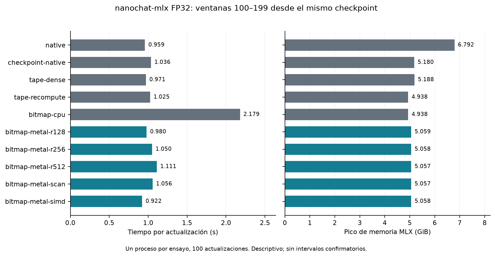
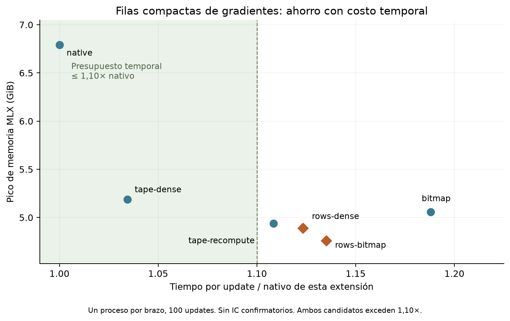
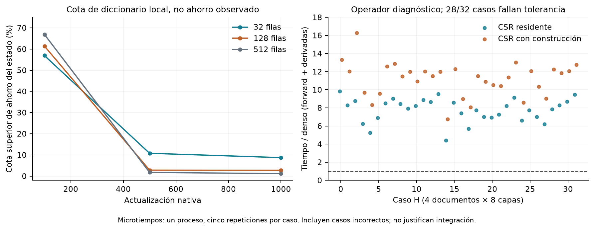

# Compresión exacta durante el entrenamiento de un GPT sobre Apple Silicon

## Un estudio de mecanismos, controles y resultados negativos

**Versión de trabajo, 15 de septiembre de 2026.** Autores y afiliaciones pendientes.
Este texto documenta experimentos terminados. No es un artículo aceptado ni una
confirmación estadística de superioridad. Datos tabulares: [results.tsv](../results.tsv).
Protocolo congelado: [manifest](../manifest.json); fuentes completas:
[sources.zip](../sources.zip). Todos los tiempos indicados son observaciones de
esta máquina y estos procesos.

## Resumen

Estudiamos si representaciones exactas compactas aportan utilidad al entrenamiento
de nanochat-mlx FP32. Distinguimos almacenamiento, planificación de activaciones y
operadores directos. En un Apple M3 Max con 128 GiB ejecutamos una trayectoria nativa
de 1000 actualizaciones y diez pilotos de 100 actualizaciones desde el mismo
checkpoint. Un bitmap GPU reduce el payload de activaciones positivas aproximadamente
55%. Sin embargo, su aporte incremental al pico MLX, frente a la misma cinta con
activaciones densas, es aproximadamente 2,5%; la mayor parte del ahorro frente al
nativo se explica por la planificación de la cinta. Una variante SIMD observa
0,922 s/actualización y 5,058 GiB de pico MLX, frente a 0,959 s y 6,792 GiB del nativo,
sin que una réplica por escenario permita afirmar superioridad estadística.
Un censo de 512 muestras de activaciones encuentra compresión por ceros pero ninguna
regla RePair. Un prototipo de productos CSR directos cuesta 11,01 veces el tiempo
local denso incluyendo construcción y falla el criterio numérico en 28/32 casos.
Las cotas de diccionario y terminales descartan las representaciones de pesos
examinadas. Ningún candidato satisface la regla de preselección registrada; no se
abrió la evaluación reservada ni se modificaron los umbrales para obtener éxito.
Una extensión de seis pilotos combina filas compactas de gradientes con el bitmap:
reduce 29,91% el pico MLX frente a su control nativo y 8,23% frente al tape denso,
pero cuesta 13,50% más tiempo que el nativo, superando el límite de 10%. Esta
extensión identifica un intercambio favorable en memoria, sin satisfacer el
criterio conjunto ni confirmar no inferioridad en una trayectoria completa.

## 1. Preguntas y contribución

La compresión exacta de una matriz conserva sus coeficientes. Su utilidad exige
además que construir, acceder y operar sobre la representación compense su costo.
En un GPT entrenable hay pesos, activaciones, gradientes y estados con vidas y
operaciones diferentes. Nuestro estudio pregunta:

1. ¿El ahorro de una activación sobrevive al medir el entrenamiento completo?
2. ¿Qué parte procede de la estructura y qué parte de cambiar la ejecución?
3. ¿La repetición exacta aprovechable por una gramática aparece en tensores reales?
4. ¿Los productos directos conservan las tolerancias y superan los kernels densos?

La contribución es un banco reproducible que conserva intentos favorables,
descartados y fallidos; una implementación de bitmap/rank en Metal; y una
caracterización inicial de estos mecanismos. No proponemos un nuevo algoritmo de
RePair ni atribuimos al artículo antecedente una estrategia de entrenamiento GPT.

## 2. Relación con el trabajo antecedente

Ferragina, Gagie, Köppl, Manzini, Navarro, Striani y Tosoni estudian matrices
comprimidas mediante gramáticas y productos matriz-vector que aprovechan su
representación. Su trabajo motiva analizar operaciones, construcción y memoria,
y no solo el tamaño serializado. Nuestro régimen agrega matrices actualizadas,
productos batched, backward y GPU. Estas extensiones requieren evidencia propia.
[Artículo antecedente](https://users.dcc.uchile.cl/~gnavarro/ps/pvldb22.pdf).

El bitmap de P y el estudio CSR de H son adaptaciones propias. Sus ceros exactos
pueden permitir ahorro aunque no haya reglas gramaticales. El ciclo de propuestas
acotadas, evaluador fijo y registro de intentos se inspira en
[autoresearch](https://github.com/karpathy/autoresearch). Para aislar el efecto de
la representación, mantenemos trabajo, datos, arquitectura y optimizador iguales.

## 3. Sistema y método

### 3.1 Modelo, hardware y trabajo comparable

nanochat-mlx: 125.829.648 parámetros, ocho bloques, dimensión 512, MLP 2048,
vocabulario 32768, atención SSSL, T=1024, B=4, acumulación de dos microbatches,
8192 tokens por actualización, FP32, Muon/AdamW y horizonte de schedule de 1000
actualizaciones. Plataforma: Apple M3 Max, 128 GiB, MLX 0.32.2, Python 3.12.11,
alimentación AC. [Entorno completo](../trials/native/environment.json).

La trayectoria de referencia usa semilla 101 y produce checkpoints completos en
10/100/400/500/900/1000. Los diez pilotos restauran el checkpoint 100 y procesan
actualizaciones 100–199. Cada uno calienta una copia, restaura el estado y mide
100 actualizaciones materializadas y sincronizadas. La referencia procesa 8.192.000
tokens de entrenamiento; las repeticiones entre brazos no representan nuevos datos
independientes. El piloto no es una comparación de convergencia desde cero.

Los procesos son separados y secuenciales. El orden inicial no fue aleatorizado;
la propuesta SIMD se ejecutó después de la cuadrícula inicial. Por ello no se
atribuye causalmente toda diferencia temporal al código ni se construyen IC usando
100 pasos correlacionados como si fueran 100 procesos independientes.

### 3.2 Particiones y procedencia

Dos shards locales contienen 106496 ocurrencias y 106431 documentos distintos.
El hash del documento asigna siempre el mismo split 90/5/5, conservando repeticiones
dentro de la partición. Hay cero documentos idénticos entre particiones. El replay
registra ocurrencias y segmentos del empaquetado BOS largest-fit/shortest-crop.

La calibración contiene 128 documentos y 82642 tokens válidos; el reservado,
1024 documentos y 641033 tokens válidos. Los targets de padding no cuentan.
Solo calibración se usa en esta campaña. No se ha auditado duplicación cercana y
la procedencia completa del tokenizer existente es desconocida. Cero coincidencias
exactas no demuestra ausencia de contaminación. El reservado es menor que el
millón de tokens contemplado inicialmente; esa diferencia se registró antes de
entrenar y no se disimula inflando el conteo con padding.

Después de los experimentos identificamos una revisión pública cuyos dos shards
coinciden byte a byte con los hashes locales: `karpathy/fineweb-edu-100b-shuffle`,
revisión `4c8f30d6756da75362432a4d5569e1b229263b71`. El
[anexo de procedencia](../verification/corpus-provenance-addendum.json) conserva
URLs fijadas, tamaños y cabeceras relevantes. Se contrastó `x-linked-etag` con
SHA256 local; el ETag del CDN identifica otro objeto XET. Esta identificación
posterior no establece cuándo ni desde qué revisión se descargaron originalmente
los archivos. El manifest original permanece intacto y las limitaciones del
tokenizer y casi duplicados permanecen abiertas.

### 3.3 Exactitud y registro

El banco previo ejecuta 128 pruebas sin fallos ni omisiones. Cada piloto compara
pérdida y gradientes de todos los parámetros en un checkpoint entrenado antes de
medir. El codec exige roundtrip exacto; los gradientes usan atol=1e-5, rtol=1e-3 y
error relativo L2≤1e-3 por tensor. La variante SIMD recibe posteriormente otras
33 pruebas, incluidas fronteras de palabra, valores especiales, liberación del
buffer denso y diez actualizaciones con reinicio intermedio.

Los snapshots incluyen cambios no comprometidos en Git. Cada intento conserva
hipótesis, código, entorno, consola, series por paso, NLL por documento, huellas
finales y hashes. Los fallos no se eliminan. Una guarda impide lecturas Python
accidentales de datos reservados; no se presenta como sandbox frente a código
nativo hostil. La cadena de hashes detecta alteraciones accidentales, sin pretender
ser certificación externa contra la reescritura de toda la evidencia.

### 3.4 Medidas y regla de avance

Reportamos tiempo por actualización, pico de bytes activos MLX, RSS y payload de
P por separado. MLX y RSS se solapan y no se suman. RSS del proceso puede omitir
residencia Metal atribuida de otra manera por macOS; ninguno se interpreta por sí
solo como toda la memoria física. La instrumentación de RSS se aplica a todos los
brazos. El payload incluye buffers y cabecera lógica de 64 bytes; no es una medida
exacta del objeto Python. La contabilidad de P registra el último microbatch, no
un censo completo de todas las asignaciones vivas.

Preselección: reducir al menos 10% el pico MLX frente al nativo, 5% adicional frente
a tape denso, tiempo≤1,10×, RSS≤1,05×, diferencia descriptiva de NLL de calibración
<0,01 y no estar dominado por recomputación. Son condiciones de ingeniería, no
prueba de no inferioridad. Una confirmación requeriría candidato congelado,
nuevas semillas, pares de procesos y planificación estadística previa; aquí no
hubo candidato admisible.

## 4. Activaciones positivas: representación frente a ejecución

Para P=ReLU(Z), guardamos ceros mediante bitmap y positivos FP32 originales como
patrones uint32. El acceso usa rank muestreado cada 128/256/512 bits; una ablación
recalcula prefijos sin índice persistente. Construcción, sincronización para
obtener el número de positivos y decodificación forman parte del tiempo del paso.
El fallback RAW se activa si no se alcanza 5% de ahorro de payload.

Controles: autodiff nativo, checkpointing nativo, tape con P denso, tape que
recomputa P y bitmap CPU histórico. Todos conservan la función y el optimizador.

| Escenario | s/update | Pico MLX GiB | Payload P/denso |
|---|---:|---:|---:|
| Nativo | 0,958646 | 6,792171 | — |
| Checkpoint nativo | 1,035871 | 5,180263 | — |
| Tape denso | 0,970747 | 5,187647 | 1,000000 |
| Tape recompute | 1,024781 | 4,937647 | 0,000000 |
| Bitmap CPU | 2,179313 | 4,937647 | 0,452252 |
| Metal rank128 | 0,980208 | 5,058817 | 0,452235 |
| Metal rank256 | 1,050415 | 5,057841 | 0,448328 |
| Metal rank512 | 1,111293 | 5,057352 | 0,446375 |
| Metal sin índice persistente | 1,056366 | 5,056864 | 0,444422 |
| Metal SIMD rank256 | 0,922360 | 5,057841 | 0,448328 |

**Atribución.** El bitmap rank256 reduce 25,53% el pico frente al nativo, pero solo
2,50% frente al tape denso. El control de cinta ya explica aproximadamente 23,62%
de reducción frente al nativo. Por tanto, atribuir toda la diferencia al bitmap
sería incorrecto. Recompute alcanza un pico menor que los bitmaps GPU, a costa de
una relación tiempo/memoria diferente en estos procesos.

**Límite del perfil.** Ocho matrices P de forma 4×1024×2048 ocupan en conjunto
256 MiB. Eliminar completamente ese almacenamiento solo representa 4,819% de los
5,188 GiB del tape denso medido, si el resto de asignaciones y su planificación
permanecen iguales. El umbral adicional de 5% supera ese presupuesto aislado.
Esta observación explica la falta de selección y delimita el régimen estudiado;
no es una imposibilidad universal de estructuras compactas. El umbral se conserva.

**Propuesta adaptativa.** La versión SIMD reemplaza lecturas por palabra con cargas
adyacentes y reducción dentro del grupo SIMD. Observa 12,19% menos tiempo que
rank256 previo y 3,79% menos que el nativo, con igual pico MLX que rank256. Es una
observación favorable que necesita repeticiones balanceadas; no se declara
aceleración confirmada. La fuente queda en el candidato editable y el intento
archivado. Las NLL finales de todos los pilotos coinciden al redondear a 6,220081;
ello no sustituye un estudio de no inferioridad con trayectorias independientes.

**Resultado formal.** Ningún bitmap pasa la preselección. El CPU además incumple
el límite piloto de tiempo: 2,273× nativo. El rechazo de `seal` por ausencia de
candidatos está [verificado](../verification/evidence-audit.json).

## 5. Estructura de pesos y estados

El censo local usa bloques de 32, 128 y 512 filas en pasos 100/500/1000. Su cota
optimista cuenta cabecera y diccionario FP32 exacto, omitiendo reglas, códigos y
otros metadatos. Si esta cota ya excede 95% del bloque denso, el formato no puede
satisfacer su selector. Un bloque no descartado sigue siendo indeciso.

En pesos, todos los bloques se descartan en los tres tamaños y checkpoints. Para
estados, la cota superior de ahorro bajo fallback RAW disminuye marcadamente:

| Filas/bloque | Paso 100 | Paso 500 | Paso 1000 |
|---|---:|---:|---:|
| 32 | 56,92% | 10,77% | 8,72% |
| 128 | 61,40% | 2,81% | 2,75% |
| 512 | 66,90% | 1,74% | 1,16% |

Son techos optimistas, **no ratios de compresión medidos**. La apariencia favorable
de estados tempranos no se conserva. Paso 0 tiene estados vacíos aún no creados;
se registra null y no un ahorro ficticio de 100%. En paso 10, todos los pesos ya
se descartan con bloques de 128 filas. El cero de inicialización de proyecciones
no se utiliza como demostración de utilidad entrenada.

Para comprobar que la decisión no dependiera solo del bloqueo, un estudio
complementario examina diccionarios por matriz y ambas orientaciones en pasos
100 y 1000. Añade una cota por terminales singleton: un terminal (bits,columna)
que aparece una sola vez no puede entrar en una regla RePair de par repetido y
debe permanecer codificado en C. Para ancho fijo b del alfabeto declarado,

`B_min = 64 + 4·d + ceil(singletons·b/8)`.

Las 58 matrices de pesos y las 64 de estados se descartan en ambos checkpoints y
orientaciones bajo ese formato global. Se registran además overflows potenciales
del alfabeto uint32. La conclusión se limita a diccionarios exactos y codificación
de terminales estudiados, no a toda representación ni a un diccionario compartido
arbitrario entre tensores. [Cotas y CSV](../dictionary-extension/summary.json).

### 5.1 Gradientes: un objeto con comportamiento diferente

Un censo adicional calcula los gradientes nativos de dos microbatches y su promedio
en checkpoints 0/10/100/500/1000: 870 observaciones matriciales. En paso 1000,
61,28% de las celdas del gradiente acumulado son ceros positivos exactos; en paso
100, 61,17%. Las 98 muestras de bloques seleccionadas para probar el codec tienen
roundtrip exacto. La selección prioriza bloques elegibles y **no** permite
extrapolar su ratio a todos los gradientes. Los estados persistentes pueden ser
densos aunque un gradiente de embeddings solo afecte filas visitadas.

Esto abre una hipótesis distinta: conservar las filas visitadas del acumulador de
gradientes entre microbatches y reconstruirlo exactamente antes del optimizador.
Se registró un piloto separado con cuatro controles y dos candidatos, incluido
su uso conjunto con P compacta. La cuadrícula original conserva su resultado.
[Plan de la extensión](../combined-gradients-r2/plan.json),
[censo de gradientes](../gradient-census/summary.json). Esta hipótesis no convierte
retroactivamente las cotas de estado en un resultado de compresión de gradientes.

V2-W y V2-I no justifican nuevos entrenamientos/inferencias de gramática sobre
pesos inelegibles. V2-O tampoco alcanza su meta de 20% de estado persistente en el
checkpoint tardío con las particiones examinadas. No se ejecutan caros ciclos de
actualización sobre candidatos que ya incumplen esa condición necesaria.

### 5.2 Acumulación por filas: entrenamiento completo de la ventana

La extensión completó seis procesos de 100 updates desde checkpoint 100, con
orden aleatorizado antes de medir, cuatro controles y dos candidatos. Conserva
solo filas visitadas en gradientes de embeddings entre microbatches, junto con
los demás gradientes densos. Cada empaquetado comprueba que las filas omitidas
contienen exclusivamente bits de cero positivo; un incumplimiento aborta.
La acumulación conserva el orden de suma, y todos los gradientes se reconstruyen
antes de actualizar Muon/AdamW. No se omiten actualizaciones de momentos o decay.

| Brazo | s/update | Pico MLX GiB | Tiempo/nativo | Ahorro vs. tape denso |
|---|---:|---:|---:|---:|
| Nativo | 0,816694 | 6,792201 | 1,000000 | −30,930% |
| Tape denso | 0,844858 | 5,187678 | 1,034485 | 0% |
| Tape recompute | 0,905295 | 4,937678 | 1,108486 | 4,819% |
| Bitmap SIMD | 0,970227 | 5,057871 | 1,187993 | 2,502% |
| Filas + tape denso | 0,917403 | 4,891736 | 1,123312 | 5,705% |
| Filas + bitmap | 0,926970 | 4,760586 | 1,135027 | 8,233% |

Los dos candidatos superan los criterios puntuales de memoria global e incremental,
RSS y calibración. **Ambos fallan tiempo ≤1,10× nativo**. No se preseleccionan ni
se abre el reservado. El acumulador contabilizado ocupa en promedio 36,49% de su
equivalente denso tras el primer microbatch y 38,77% tras el segundo; ese ahorro
local no se confunde con el pico de todo el entrenamiento.

La NLL de calibración difiere del nativo en menos de 4,0×10⁻⁸ para los dos candidatos.
Esto es descriptivo, sin demostrar no inferioridad. La prueba pequeña de diez
updates pasa tolerancias de pesos y estados, y la puerta inicial compara gradientes
del modelo completo. Sin embargo, las huellas finales tras 100 updates difieren:
ningún tensor del modelo tiene hash idéntico al control correspondiente. No se
guardaron checkpoints finales para medir esa distancia. Compresión exacta de bits
no equivale a trayectoria flotante idéntica ni verifica por sí sola estabilidad
de entrenamiento largo.

El primer intento falló antes de los pilotos por comparar listas de estados del
optimizador por posición, con órdenes de inserción distintos. La revisión r2
compara rutas de parámetros, conservando tolerancias. Se preservan la fuente y el
[fallo original](../combined-gradients/failure.json); el log completo original solo
estuvo en consola. [Autopruebas r2](../combined-gradients-r2/selftest.json).

Las comparaciones utilizan **el nativo de esta extensión**. Reutilizar el tiempo
nativo mayor de la campaña principal produciría una selección injustificada.
La diferencia entre procesos, y el cambio temporal del bitmap aislado, refuerzan
la necesidad de replicación independiente y controles intercalados. Esta extensión
usa una lista de dos microbatches preparada por update; los controles comparten
esa ruta. No se mezclan sus tiempos o picos con los de la campaña principal.
[Tabla reproducible, huellas y auditoría](../verification/closeout-r2/report.md).

La región sombreada representa únicamente el presupuesto temporal. Para ser
elegible también hay que satisfacer los demás criterios de memoria y calidad.

## 6. H compacta y productos directos

### 6.1 Compresión sin reglas

En el checkpoint 1000, 32 documentos de calibración, primeras 128 posiciones
válidas y todas las capas, producen 256 muestras de P y 256 de H. Todas tienen
roundtrip exacto y **cero reglas RePair**. El payload del formato CSRV/gramática
ocupa 34,16% del denso; el residente contabilizado, aproximadamente 34,20%.
El ahorro en estas muestras deriva de la representación dispersa, sin evidencia
de ahorro adicional por reglas. La muestra es mayor que la inicial, pero no un
censo estratificado de toda la distribución o todas las etapas de aprendizaje.

### 6.2 Prototipo Metal CSR

Implementamos Y=H·W2ᵀ directamente sobre CSR y dW2=(Hᵀ·G)ᵀ sobre CSR transpuesta.
dH=G·W2 conserva el producto denso. Ambos índices/orientaciones cuentan en memoria,
y construirlos cuenta en la variante de ciclo completo. El almacenamiento de las
dos orientaciones suma 77,02% de H densa en los 32 casos de operadores.

H y W2 proceden del modelo entrenado. G es una cotangente sintética normal con
semilla fijada; no se presenta como gradiente capturado de la pérdida del GPT.
Se validan representación, operador y VJP pequeño, y luego cuatro documentos por
ocho capas. Cinco repeticiones por caso dentro de un proceso dan diagnósticos,
no intervalos de rendimiento de procesos independientes.

Media geométrica descriptiva de ratios por caso: **7,66× denso** con CSR ya
construida, **11,01×** incluyendo construcción. Rango con construcción:
6,77–16,27×. Son tiempos locales de forward y derivadas, no tiempo de entrenamiento
completo. Las tablas incluyen los casos que fallan corrección y no avalan uso.

### 6.3 Discrepancias y oráculo

dW2 y dH pasan en 32/32 casos, pero el forward incumple
`|error| ≤ 1e-5 + 1e-4·|referencia|` en 28/32. Son 759 de 2.097.152 salidas
(aproximadamente 0,0362%). El error relativo global pequeño no invalida un fallo
por elemento.

El diagnóstico FP64 selecciona hasta 64 coordenadas discrepantes por caso y la
coordenada de máximo error absoluto. Examina 747 de las 759 discrepancias, además
de coordenadas diagnósticas adicionales. En esas 747, el denso falla el criterio
respecto al oráculo en 579, CSR en 114 y ambos en 87. CSR está más cerca del oráculo
en 681. Esto es consistente con sensibilidad al orden de acumulación y cancelación;
no constituye por sí solo una demostración de ausencia de carreras del kernel.

La comparación obligatoria original **permanece fallida**. No relajamos tolerancias,
no declaramos equivalencia y no integramos el operador en entrenamiento. Un estudio
futuro de criterios numéricos necesitaría protocolo nuevo, análisis causal y datos
confirmatorios distintos. [Diagnóstico por coordenada](../direct-diagnosis/summary.json).

## 7. Desarrollo, decisiones y salvaguardas

1. La primera construcción Metal basada en comparaciones float perdió subnormales:
   20 pruebas fallidas, 11 aprobadas. Se conserva código y registro; el log original
   solo estuvo en consola, limitación explícita.
2. La corrección por patrones enteros aprobó las 31 pruebas específicas originales.
3. El arnés integrado aprobó 128 pruebas y un smoke de entrenamiento/reinicio.
4. La cuadrícula principal completó los nueve escenarios registrados.
5. La propuesta SIMD añadió un ensayo real y 33 pruebas posteriores aprobadas.
6. Los estudios complementarios separaron ceros, gramáticas y productos directos;
   conservaron los fallos por elemento y la evidencia FP64 que los contextualiza.
7. Todos los hashes de ensayos y estudios se verificaron. Sin preselección no se
   abrió la confirmación reservada. Los informes usan null para ausencia de métricas.
8. La extensión completó seis pilotos y preservó el intento previo fallido. La
   [auditoría de cierre](../verification/closeout-r2/audit.json) verifica once
   ensayos principales, seis de la extensión y seis registros complementarios
   (cinco estudios completados y un intento fallido). Recalcula las decisiones
   desde sus métricas y verifica que las fuentes protegidas siguen intactas.

El límite de disco preservó checkpoints nativos necesarios y huellas finales por
tensor para los pilotos. Estas huellas permiten auditar replay, no reanudar desde
el estado final sin reconstruirlo. No se borraron checkpoints históricos para
crear espacio. La búsqueda conserva dos propuestas disponibles dentro del máximo
de 12 pilotos; no es obligatorio gastarlas en variantes incapaces de superar el
presupuesto de memoria de P bajo esta planificación.

## 8. Amenazas a la validez y alcance pendiente

- Un hardware, una configuración FP32 y una semilla de exploración; entrenamiento
  temprano, no un checkpoint maduro representativo de todos los GPT.
- Orden de pilotos no balanceado, posible variación térmica/carga del sistema y
  una observación por escenario. El resultado SIMD temporal es provisional.
- Calibración reutilizada adaptativamente; reservado intacto, pero tokenizer y
  casi duplicados impiden afirmar independencia completa de datos.
- Muestreo de activaciones limitado; el censo de gradientes cubre dos microbatches
  por checkpoint, no todas las actualizaciones. Falta instrumentación completa de
  las vidas de todos los buffers.
- La extensión de filas guarda hashes finales, no valores finales completos. Su
  trayectoria de 100 updates no es bit a bit idéntica; falta cuantificar las
  distancias de pesos/estados a tamaño completo y evaluar trayectorias largas.
- Diccionarios globales aquí son por matriz y ancho fijo. Otras codificaciones,
  bitplanes, capas/precisiones/regímenes de batch no quedan descartados.
- CSR directo es un prototipo con acceso irregular; su resultado negativo no es
  una cota inferior de rendimiento para todo kernel sparse posible.
- No se ejecutaron cuantización, LoRA congelado, KV, compresión de checkpoints ni
  confirmación estadística. Son ramas separadas, no resultados ausentes imputados.
- El plan confirmatorio implementado fija mínimos operativos; antes de una nueva
  confirmación debe justificar potencia y supuestos con pilotos independientes.
  No basta aceptar automáticamente cinco semillas como garantía de potencia.

## 9. Conclusión

Las estructuras compactas **sí reducen representaciones reales** de activaciones,
así como acumuladores de gradientes, pero esta campaña no acredita el criterio
conjunto de memoria, tiempo y calidad confirmada. La combinación de filas y bitmap
logra ahorro global e incremental en el piloto, excediendo el presupuesto temporal.
Separar
controles evita atribuir a un bitmap el ahorro de cambiar la planificación.
La evidencia favorece seguir investigando formatos ligeros para ceros exactos en
regímenes donde P represente una fracción mayor de memoria, con umbrales fijados
antes de medir. Para esta configuración mantenemos el nativo como ruta por defecto;
los controles de checkpointing/cinta y la propuesta SIMD quedan disponibles para
nuevos estudios, sin promoción automática a producción.

La gramática exacta de pesos/estados estudiada carece de condiciones estructurales
suficientes en los checkpoints posteriores. En H, el ahorro por ceros no se traduce
en un operador directo admisible. Estos resultados negativos y las observaciones
favorables delimitadas son el resultado científico actual; no afirmamos una
imposibilidad universal ni una mejora confirmada donde no se midió.

## Referencias y reproducibilidad

- Ferragina et al. *Improving Matrix-vector Multiplication via Lossless
  Grammar-Compressed Matrices*. PVLDB 15(10), 2175–2187, 2022.
  [DOI](https://doi.org/10.14778/3547305.3547321). El PDF enlazado por el autor tiene
  placeholders bibliográficos; se utiliza la referencia publicada.
- [karpathy/autoresearch](https://github.com/karpathy/autoresearch): antecedente
  del ciclo de propuestas, evaluador fijo y registro.
- [Especificación v2](../../../../../ESPECIFICACIONES_NAVARRO_NANOCHAT_MLX.md).
- [Runbook](../../../../../docs/navarro/autoresearch-v2.md) y
  [programa del agente](../../../../../research/navarro/program.md).
- [Fuentes de los estudios complementarios](../../studies/),
  [datos descriptivos](results.md), [registro de eventos](../ledger.jsonl).
- Figuras vectoriales: [entrenamiento PDF](figures/training.pdf),
  [mecanismos PDF](figures/mechanisms.pdf),
  [extensión de gradientes PDF](combined-figures-r2/combined.pdf).
  Versiones SVG y PNG en los mismos directorios.
  El generador registra versiones y hashes en [manifest](figures/manifest.json).
